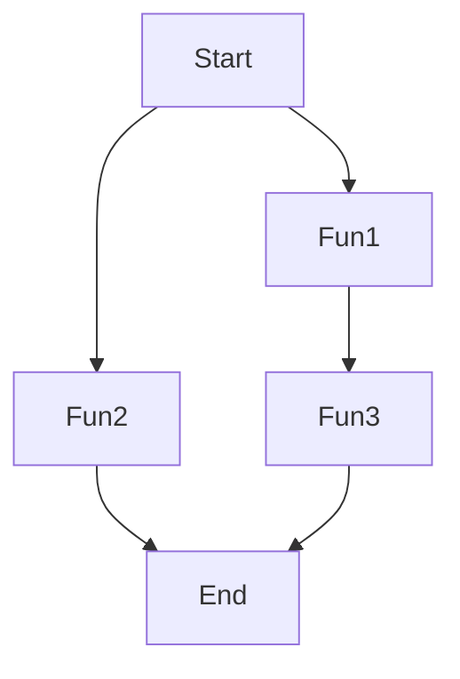

## Description

Backend server with ExpressJS, provide CRUD interface that allow a user to interact with the service.

## Preapration

```mermaid
graph TD;
  Start--> Fun1;
  Start--> Fun2;
  Fun2-->End;
  Fun1-->Fun3;
  Fun3-->End;
```
