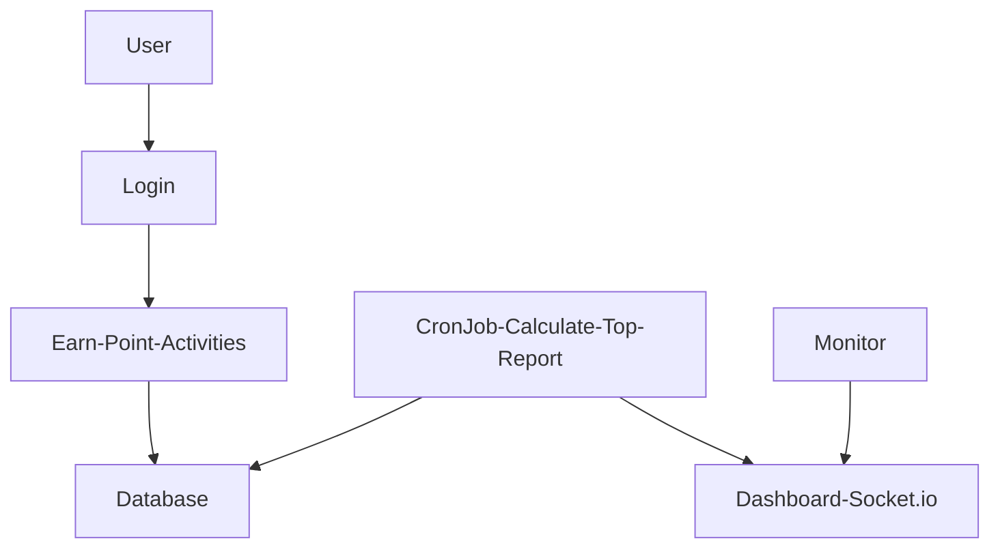

# Diagram

Build score board allow live update base on user activities. It show top 10 user's scores

# Explain

We have 3 part for this application:

## Part 1: Update user's scores to database

The player have to login to system via login page to do activities and earn scores, only authenticated user can get scores. This thing can prevent malicious users 

## Part 2: Show top user's scores to dashboard

The API to show top user's scores can public (or private if need), the FE will use this data to show the ranking. We will use Socket.IO to allow server can live update latest data to dashboard

## Part 3: Cron job to calculate top user's scores every 10 seconds 

If we have so many players, we won't want the top user's scores is calcualated so many time in a few seconds. So we can use cronjob to re-calculate top user's scores every 10 seconds to make the process work efficiently
